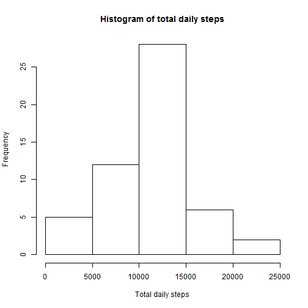
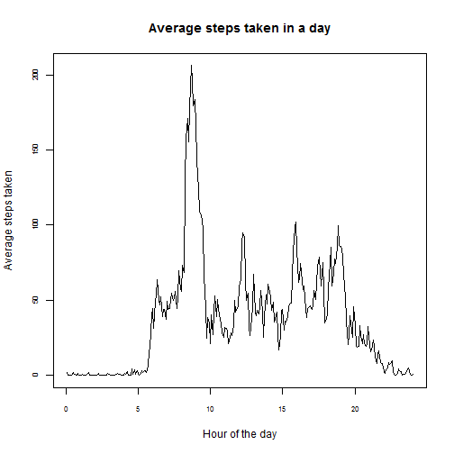
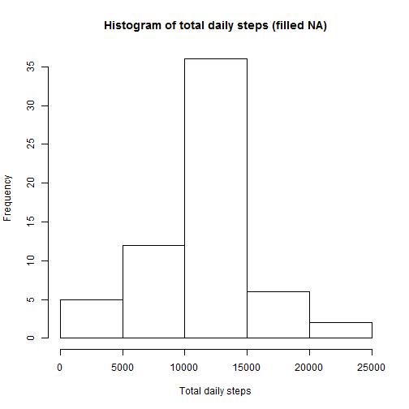
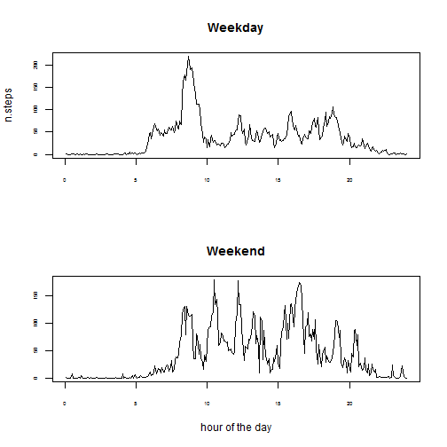

# Reproducible Research: Peer Assessment 1


## Loading and preprocessing the data

The following code reads the dataset "activity.csv" and stores it as <dat>. Also the "date" column is turned to a "Date" class, so functions related to dates can be applied. Work directory should be changed depending on the directory where the dataset is stored.


```r
setwd("C:/Users/Esteban/Desktop/R COURSERA/REPROD RES/ASSIGNMENT 1")
dat <- read.csv("activity.csv")
dat$date <- as.Date(dat$date, format = "%Y-%m-%d")
```


## What is mean total number of steps taken per day?

In order to know mean total number of steps we obtain the total number of steps per day using tapply. The distribution of total steps per day can be seen in the folloeing hist:


```r
n.steps <- tapply(dat$steps, dat$date, sum)
hist(n.steps, main = "Histogram of total daily steps", xlab = "Total daily steps")
```

 


Generally, there are between 10,000 and 15,000 steps taken daily.

We obtain the mean value for the days which have a record. We use na.rm=T so we exclude days with missing data:


```r
promedio <- mean(n.steps, na.rm = T)
promedio
```

```
## [1] 10766
```


We use the same reasonning for the median:


```r
mediana <- median(n.steps, na.rm = T)
mediana
```

```
## [1] 10765
```


## What is the average daily activity pattern?

There are 24*60/5= 288 intervals of 5 minutes in a 24hr day and records are from 61 days. We want to find the average number of steps taken, averaged across all days. In order to do that, we first want to identify for each row, to what part of the day the interval corresponds. In order to do so we created an "intervals" matrix, where we show an extract from it:


```r
intervals <- matrix(NA, 288, 61)
for (i in 1:288) {
    intervals[i, ] <- seq(i, 288 * (61 - 1) + i, length.out = 61)
}
head(intervals[, 1:10])
```

```
##      [,1] [,2] [,3] [,4] [,5] [,6] [,7] [,8] [,9] [,10]
## [1,]    1  289  577  865 1153 1441 1729 2017 2305  2593
## [2,]    2  290  578  866 1154 1442 1730 2018 2306  2594
## [3,]    3  291  579  867 1155 1443 1731 2019 2307  2595
## [4,]    4  292  580  868 1156 1444 1732 2020 2308  2596
## [5,]    5  293  581  869 1157 1445 1733 2021 2309  2597
## [6,]    6  294  582  870 1158 1446 1734 2022 2310  2598
```


This matrix contains 288 rows and 61 columns corresponding to 288 5-minute intervals for 61 days. For example, the first row "intervals[,1]" will tell us which observations correspond to the 1st 5-minute interval of each day. So observation 1 (intervals[1,1]) is the fist interval of day 1, then observation 289 (intervals[1,2]) from the main dataset, is the first observation of the day 2. More explicitly this matrix will tell us the following:

    intervals[the n-th period of the day,the day of observation]

Then we want to know the mean of each 5-minute interval so we subset the mian database in function of the intervals matrix, and we create a vector with the result so we can make a time-series plot.


```r
time_series <- rep(NA, 288)
for (i in 1:288) {
    time_series[i] <- mean(dat$steps[intervals[i, ]], na.rm = T)
}
time.lab <- seq(24/288, 24, by = 24/288)

plot(time_series ~ time.lab, type = "l", main = "Average steps taken in a day", 
    xlab = "Hour of the day", ylab = "Average steps taken", cex.axis = 0.7)
```

 


As we can see, most of the steps taken are around 9, more exactly the time interval with more steps taken is the 104th, which i equivalent to the time between 8:35 and 8:40, as it follows. 


```r
per <- grep(max(time_series), time_series)
print(per)
```

```
## [1] 104
```

```r
paste("interval ending at ", floor(per * 5/60), " hrs and ", round((per * 5/60 - 
    floor(per * 5/60)) * 60, 0), " minutes", sep = "")
```

```
## [1] "interval ending at 8 hrs and 40 minutes"
```


## Imputing missing values

There are 2304 many missing values in the steps column. 


```r
length(dat$steps[is.na(dat$steps)])
```

```
## [1] 2304
```


In order to avoid problems with missing information we will fill in the NA values with the mean  value,as integer, regarding the interval of the day at which it corresponds as following:


```r
dat.f <- dat
for (i in 1:nrow(dat)) {
    if (is.na(dat.f$steps[i]) == TRUE) {
        dat.f$steps[i] <- time_series[round(ifelse(i/288 - floor(i/288) == 0, 
            288, (i/288 - floor(i/288)) * 288), 0)]
    }
    dat.f$steps <- round(dat.f$steps, 0)
}
```


From now on, we wil use the dataset dat.f as main dataset, which has missing values filled in. The difference in new results are as shown in the following results:


```r
n.steps.f <- tapply(dat.f$steps, dat.f$date, sum)
hist(n.steps.f, main = "Histogram of total daily steps (filled NA)", xlab = "Total daily steps")
```

 

```r
mean(n.steps.f)
```

```
## [1] 10766
```

```r
median(n.steps.f)
```

```
## [1] 10762
```

```r

```


The difference is notticed in the median value.

## Are there differences in activity patterns between weekdays and weekends?

In this section we are checking if there is a behaviour deifference in number of steps taken considered if it is a weekend's day or a regular day.


```r
dat.f$weekday <- ifelse(weekdays(dat.f$date)[i] == "sábado" | weekdays(dat.f$date) == 
    "domingo", "weekend", "weekday")
dat.f$weekday <- as.factor(dat.f$weekday)
```


In order to see the difference in steps taken at wwekdays and weekends, we create two subsets, one for weekdays and another for weekends and then evaluate them as follows:


```r
for (i in 1:nrow(dat.f)) {
    dat.f$interv.day[i] <- round(ifelse(i/288 - floor(i/288) == 0, 288, (i/288 - 
        floor(i/288)) * 288), 0)
}
wd <- subset(dat.f, dat.f$weekday == "weekday")
we <- subset(dat.f, dat.f$weekday == "weekend")
```


```r
time_wd <- tapply(wd$steps, wd$interv.day, mean)
time_we <- tapply(we$steps, we$interv.day, mean)
par(mfrow = c(2, 1))
plot(time_wd ~ time.lab, type = "l", cex.axis = 0.5, ylab = "n.steps", xlab = "", 
    main = "Weekday")
plot(time_we ~ time.lab, type = "l", cex.axis = 0.5, xlab = "hour of the day", 
    ylab = "", main = "Weekend")
```

 


The is a difference in the average steps taken by the interval of the day between weekdays and wwekends, in weekdays there is a time in the dime that is much more common than the other, whereas in the weekends there is not. 
